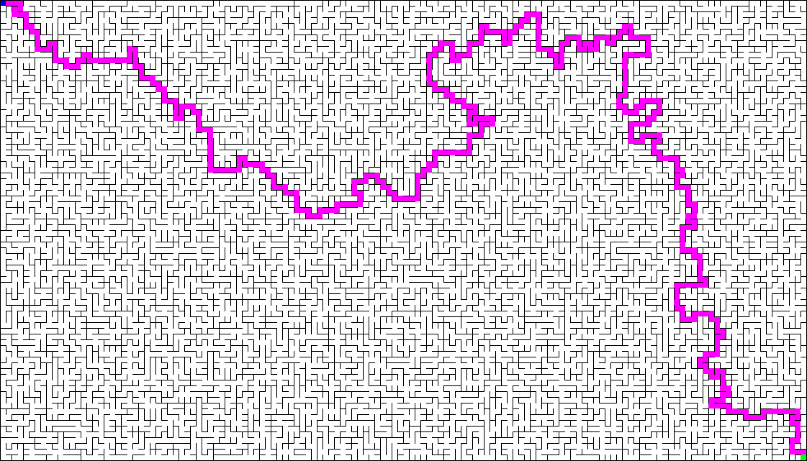

```
███    ███  █████  ███████ ███████        ██████  ███████ ███    ██ ███████ ██████   █████  ████████  ██████  ██████  
████  ████ ██   ██    ███  ██            ██       ██      ████   ██ ██      ██   ██ ██   ██    ██    ██    ██ ██   ██
██ ████ ██ ███████   ███   █████   █████ ██   ███ █████   ██ ██  ██ █████   ██████  ███████    ██    ██    ██ ██████  
██  ██  ██ ██   ██  ███    ██            ██    ██ ██      ██  ██ ██ ██      ██   ██ ██   ██    ██    ██    ██ ██   ██
██      ██ ██   ██ ███████ ███████        ██████  ███████ ██   ████ ███████ ██   ██ ██   ██    ██     ██████  ██   ██
```

## Presentation

maze-generator is a program for generating and solving a maze. It is possible to show and
save the image of the generated maze.



The program is written in Java and uses [Maven](https://maven.apache.org/) as dependency manager.


## Run tests

```shell
mvn test
```

## Project generation

To generate this project, you have to run the following command :

```shell
mvn package
```

This command generates a `maze-generator.jar` jar in the target folder.

## Commands

### Show help

```shell
java -jar maze-generator.jar --help
```

### Generate and show maze

```shell
java -jar maze-generator.jar --width 150 --height 150 --show
```

### Generate and show maze with custom start and custom end cells

```shell
java -jar maze-generator.jar --width 200 --height 100 --show --start 0,50 --end 199,50
```

### Generate and save maze on file _maze.png_ with custom cells size

```shell
java -jar maze-generator.jar --name maze --width 40 --height 40 --save --cellSize 30
```

## Dependencies

This project uses some dependencies : 

* [Lombok](https://projectlombok.org/) to declare model classes. There is a [plugin for IntelliJ](https://projectlombok.org/setup/intellij)
* [Apache commons cli](https://commons.apache.org/proper/commons-cli/) to parse commands args.

## Maze rendering

The maze image is generated with this coordinate model with (x,y) : 

```
0,0 1,0 2,0 3,0
0,1 1,1 2,1 3,1
0,2 1,2 2,2 3,2
0,3 1,3 2,3 3,3
```